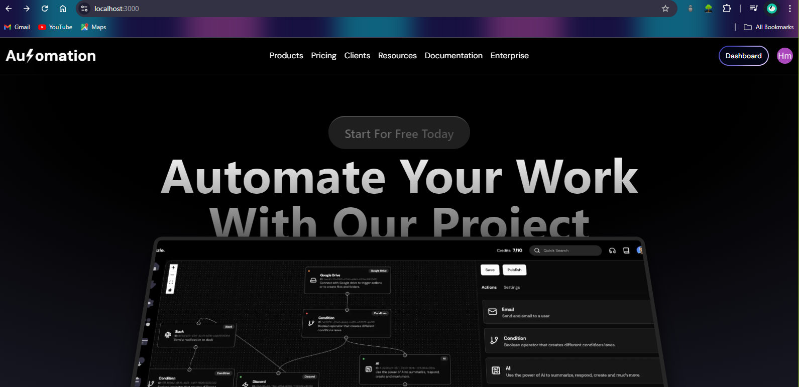
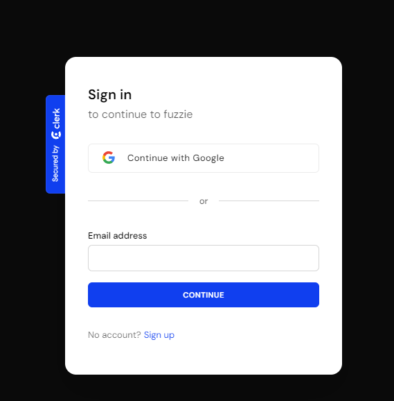
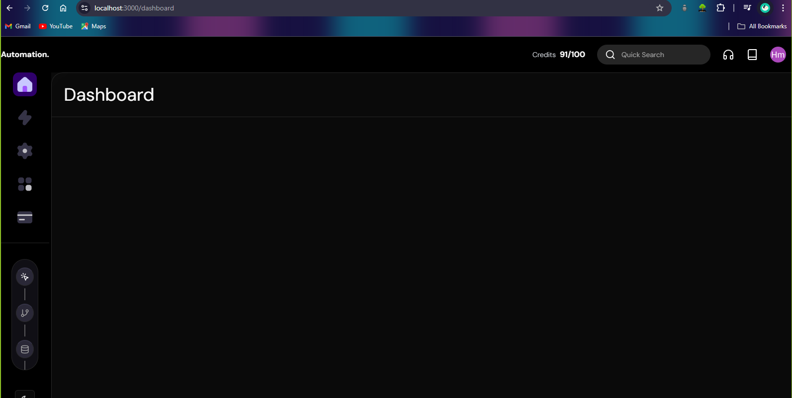
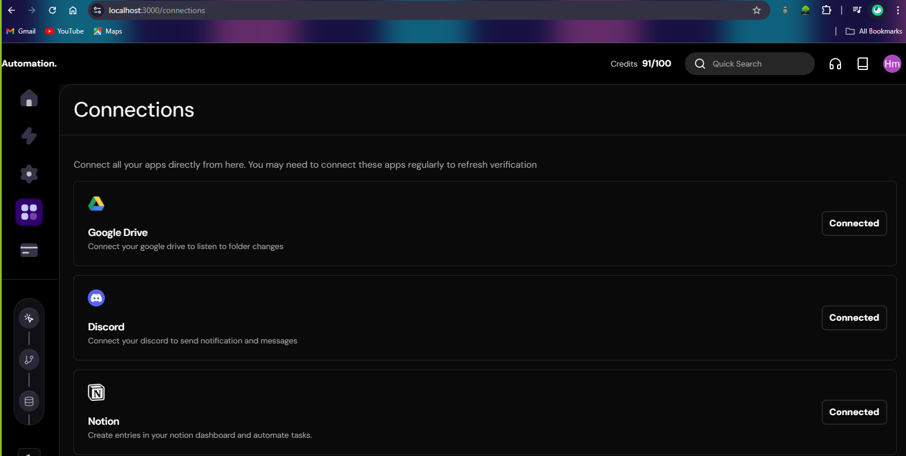
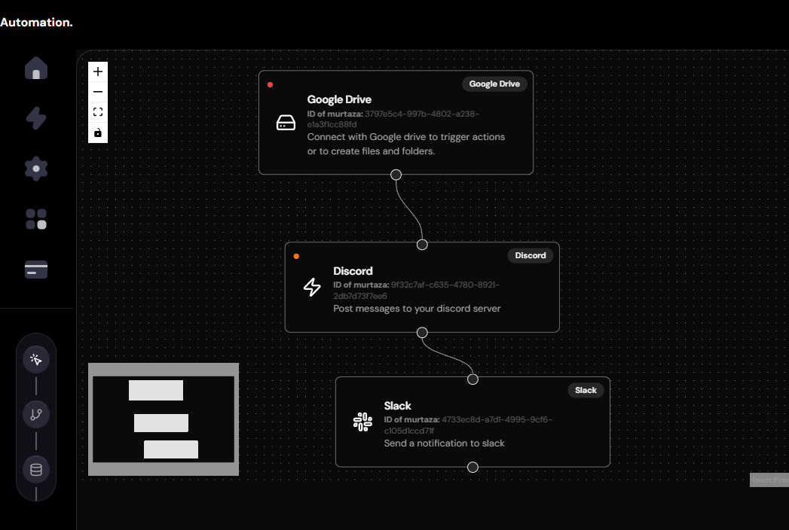
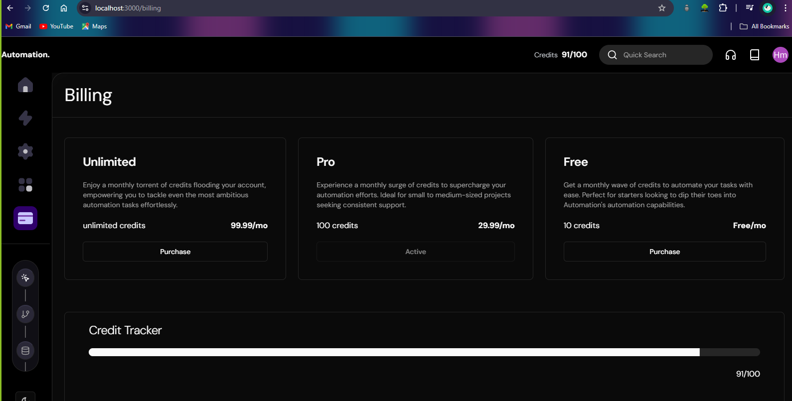

<h1>SaaS Workflow Management System</h1>

The SaaS Workflow Management System is a powerful platform that simplifies and automates business processes. With a drag-and-drop interface, users can create workflows by integrating various apps and services without coding. Scalable for all business sizes, its secure cloud-native architecture ensures high performance and data protection. Ideal for driving efficiency, consistency, and cost savings, this system supports digital transformation.

<h2> System Design</h2>

The system is a B2C SaaS platform designed to integrate various third-party services (Google Drive, Slack, Discord, Notion) with real-time monitoring and automation capabilities. The platform supports subscription-based payments via Stripe and provides a user-friendly interface with advanced UI features.

<h2>Features:</h2>
- Authentication & Authorization: Secure user login and management using JWT tokens.
- Integration Management: UI for connecting Google Drive, Slack, Discord, and Notion accounts.
- Node Interface & Builder: A drag-and-drop interface for building automation workflows.
- Mini Map & Infinite Canvas: Visualization tools to help users manage and navigate their workflows.
- Light & Dark Mode: Customizable UI with an expandable sidebar.
- Landing Page: A beautifully designed landing page for marketing and user onboarding.

<h2>Project Images</h2>

* ## Landing Page:

* ## Sign In Page:

* ## Dashboard:

* ## Connections:

* ## Workflow:

* ## Billing:

<h3>Project Members:</h3>

- Murtaza Ahmad Bazaz
- Kaleem Ali
- Muied Zahoor

<h3>Project Supervisor:</h3>

- Dr. Hushmat Amin Kar 
